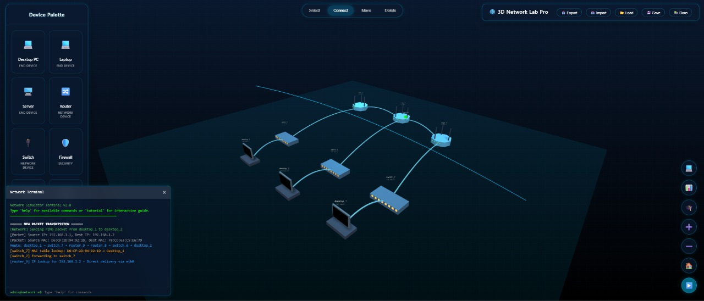

# Cisco Lab Simulator

A 3D interactive network laboratory for designing, configuring, and simulating Cisco networking environments.



## Overview

Cisco Lab Simulator is a web-based application that allows networking students, professionals, and enthusiasts to create, manipulate, and test virtual network topologies in a 3D environment. Built with HTML, CSS, and Three.js, this simulator provides a professional and intuitive interface for designing and learning networking concepts.

## Features

- **3D Interactive Environment**: Drag-and-drop network devices into a 3D workspace
- **Comprehensive Device Library**: PCs, laptops, servers, routers, switches, firewalls, and more
- **Real-time Connections**: Connect devices with animated connections
- **Network Simulation**: Visualize packet transmission and protocol behaviors
- **Terminal Interface**: Execute networking commands and see real-time responses
- **Network Monitoring**: Track traffic, observe routing tables, and view logs
- **Interactive Tutorials**: Learn networking concepts through guided exercises
- **Detailed Documentation**: Export network diagrams and configurations

## Supported Protocols and Simulations

- **ICMP/Ping**: Test connectivity between devices
- **TCP/IP**: Visualize the 3-way handshake process
- **Traceroute**: See the path packets take through your network
- **DHCP**: Watch the address assignment process (DORA)
- **DNS**: Observe domain name resolution
- **ARP**: View address resolution protocol in action

## Getting Started

1. Clone the repository:
   ```
   git clone https://github.com/yourusername/cisco-lab-simulator.git
   ```

2. Open `index.html` in your browser.

3. Start building your network by dragging devices from the palette to the 3D workspace.

4. Connect devices using Connect Mode (button 2 on the mode selector).

5. Configure device properties by clicking on them in Select Mode.

6. Run simulations and observe network behavior.

## Usage Guide

### Interface Components

- **Device Palette**: Contains all available network devices
- **Mode Selector**: Switch between Select, Connect, Move, and Delete modes
- **Main Workspace**: 3D environment for building networks
- **Properties Panel**: Configure device settings (IP address, subnet, etc.)
- **Terminal**: Execute networking commands
- **Network Monitor**: View traffic statistics and logs
- **Floating Action Buttons**: Access tools and simulations

### Keyboard Shortcuts

- `1`: Select Mode
- `2`: Connect Mode
- `3`: Move Mode
- `4`: Delete Mode
- `Ctrl+T`: Toggle Terminal
- `Ctrl+M`: Toggle Network Monitor
- `Ctrl+H`: Show Help
- `Escape`: Cancel/Close dialogs
- `Delete`: Remove selected device

### Terminal Commands

- `help`: Display available commands
- `ping [device]`: Test connectivity to a device
- `traceroute [device]`: Trace route to destination
- `show devices`: List all network devices
- `show connections`: List all connections
- `config [device]`: Configure a device
- `connect [device1] [device2]`: Connect two devices
- `disconnect [device1] [device2]`: Disconnect two devices
- `analyze network`: Analyze network topology

## Educational Resources

The simulator includes several interactive tutorials:

- **Basic Network Setup**: Learn to create a simple network
- **TCP/IP Protocol**: Understand Internet protocols
- **Routing Basics**: Learn routing concepts
- **VLAN Configuration**: Configure virtual LANs
- **Network Security**: Implement security measures
- **Troubleshooting**: Practice network diagnostics

## Technical Implementation

The simulator is built with:

- **HTML5**: Structure and content
- **CSS3**: Styling and animations
- **JavaScript**: Logic and interactivity
- **Three.js**: 3D rendering and physics
- **Network Algorithms**: Path finding, routing, and packet transmission

## Browser Compatibility

The simulator works best with modern browsers that support WebGL:

- Google Chrome (recommended)
- Mozilla Firefox
- Microsoft Edge
- Safari

## License

This project is licensed under the MIT License - see the [LICENSE](LICENSE) file for details.

## Contributing

Contributions are welcome! Please feel free to submit a Pull Request.

## Acknowledgments

- Three.js for 3D rendering capabilities
- Cisco for network protocol inspiration
- The networking community for feedback and suggestions

---

*Disclaimer: This simulator is for educational purposes only and is not affiliated with or endorsed by Cisco Systems, Inc.*